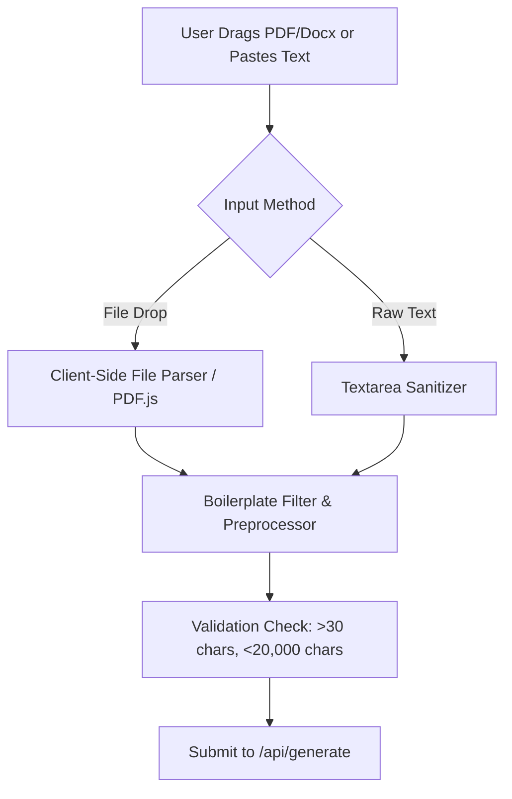

# Fix Spec 01: PDF & Document Job Description Input Parsing

- **Issue Type:** FRICTION
- **Target File(s):** [JDInput.tsx](file:///Users/dhananjayrawat/Antigravity/PrepAI/prepai/components/JDInput.tsx), [app/api/generate/route.ts](file:///Users/dhananjayrawat/Antigravity/PrepAI/prepai/app/api/generate/route.ts)
- **Priority:** HIGH
- **Affected Route(s):** `/`, `/dashboard`

---

## 1. Current State & Root Cause Analysis

Currently, [JDInput.tsx](file:///Users/dhananjayrawat/Antigravity/PrepAI/prepai/components/JDInput.tsx) only provides a plain `<textarea>` for users to paste raw text. 

### Limitations & Pain Points:
1. Candidates receiving job postings as PDF/Docx files must manually open, select, copy, and paste text into the browser.
2. Copying from PDF often introduces whitespace noise, line-wrap broken sentences, and unwanted header/footer artifacts.
3. The textarea has a hard limit of `maxLength={8000}`. Comprehensive enterprise job descriptions (e.g., Microsoft SDE 3 postings with team mission, responsibilities, requirements, benefits, and equal opportunity disclaimers) often exceed 8,000 characters. Crucial technical skills pasted at the bottom get silently truncated.

---

## 2. Proposed Technical Architecture



### Key Changes:
1. **File Upload Dropzone:** Add drag-and-drop file upload zone supporting `.pdf`, `.docx`, and `.txt` files.
2. **Text Extraction:** Use client-side PDF parsing (`pdfjs-dist` or lightweight text extractor) to instantly extract raw text from dropped documents without extra network latency.
3. **Smart Boilerplate Stripper:** Automatically strip standard recruiter disclaimers (e.g., "Equal Opportunity Employer", "About Our Benefits", "How to Apply") to keep focus on technical skills and responsibilities.
4. **Increased Capacity:** Increase character limit from 8,000 to 20,000 characters.

---

## 3. Step-by-Step Implementation Plan

### Step 3.1: Update `JDInput.tsx` UI
- Add a tabs or dual-mode toggle between **"Paste Text"** and **"Upload Document (PDF / DOCX)"**.
- Implement drag-and-drop file dropzone with visual drag-active states.
- Display parsed filename, detected character count, and a preview snippet upon successful file parse.

```tsx
// Dropzone State Interface
interface FileUploadState {
  fileName: string | null;
  fileSize: number | null;
  parsing: boolean;
  error: string | null;
}
```

### Step 3.2: Text Parsing & Sanitization Logic
- Extract pure text using `pdfjs-dist` or browser `FileReader`.
- Apply boilerplate cleaning regex:
```typescript
export function sanitizeJDText(rawText: string): string {
  let cleaned = rawText
    .replace(/Equal Opportunity Employer[\s\S]*$/i, "")
    .replace(/Benefits & Perks[\s\S]*$/i, "")
    .replace(/\r\n/g, "\n")
    .replace(/\n{3,}/g, "\n\n");
  return cleaned.trim().slice(0, 20000);
}
```

### Step 3.3: Update API Schema & Endpoint
- Update `app/api/generate/route.ts` payload validator to allow up to 20,000 characters.
- Maintain backward compatibility for raw string payloads.

---

## 4. Regression Prevention & Fallback Strategy

- **Zero Breaking Changes:** The existing paste textarea remains active as the primary or alternate tab.
- **Graceful Fallback:** If PDF extraction fails (e.g. password-protected or scanned image PDF), render a clear error toast: *"Could not extract text from scanned PDF. Please copy and paste text manually."* with automatic switch to manual textarea.
- **Payload Safety:** Enforce server-side character truncation at 20,000 chars in `app/api/generate/route.ts` to prevent Gemini API context overflow.

---

## 5. Verification & Acceptance Criteria

1. **Upload Test:** Drag a 5-page PDF job description into the upload zone. Confirm text is extracted within 1 second.
2. **Boilerplate Stripping Test:** Verify legal disclaimers are removed while core technical requirements are preserved.
3. **Character Limit Test:** Submit a 15,000-character JD. Confirm full payload is sent to Gemini without 8,000-char truncation errors.
