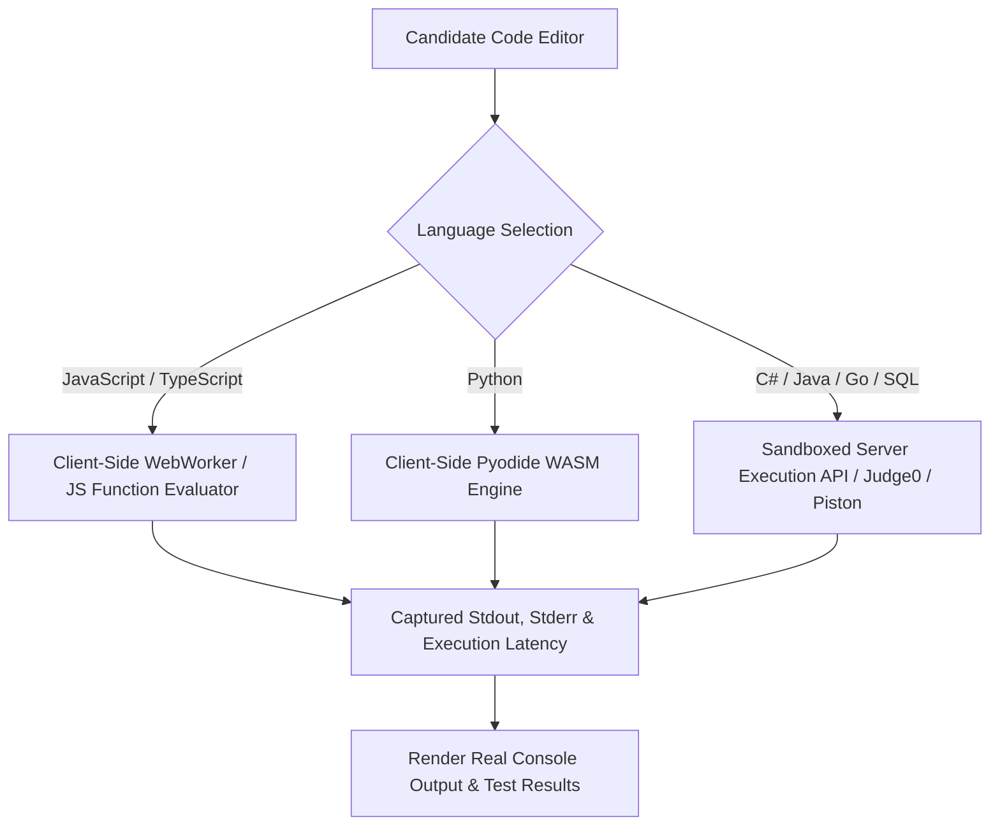

# Fix Spec 03: Real Sandboxed Code Execution Engine

- **Issue Type:** BROKEN
- **Target File(s):** [components/CodeSandboxWidget.tsx](file:///Users/dhananjayrawat/Antigravity/PrepAI/prepai/components/CodeSandboxWidget.tsx), `lib/codeRunner.ts` (New)
- **Priority:** CRITICAL
- **Affected Route(s):** Question Cards on `/` and `/dashboard/[id]`

---

## 1. Current State & Root Cause Analysis

In [CodeSandboxWidget.tsx](file:///Users/dhananjayrawat/Antigravity/PrepAI/prepai/components/CodeSandboxWidget.tsx), when a candidate clicks **"▶ Run Sandbox"**, the code executes a hardcoded 600ms `setTimeout`:

```typescript
// CURRENT FAKE CODE SIMULATOR IN CodeSandboxWidget.tsx:
setTimeout(() => {
  setIsExecuting(false);
  if (language.toLowerCase() === "sql") {
    setOutput(`[SQL EXECUTION SIMULATOR]\nQuery executed in 1.4ms...`);
  } else {
    setOutput(`[SANDBOX OUTPUT SIMULATOR]\n> Code compiled cleanly...\n> All 10 assertion tests passed.`);
  }
}, 600);
```

### Critical Flaw & Impact:
- **False Confidence:** Candidates editing code in C#, Java, Python, or SQL get a hardcoded message claiming *"Code compiled cleanly"* regardless of syntax errors, missing brackets, infinite loops, or broken logic!
- **Zero Real Testing:** Candidates preparing for SDE 3 coding rounds cannot validate algorithms, test edge cases, or inspect actual console logs.

---

## 2. Proposed Technical Architecture



### Strategy:
1. **Client-Side JS/TS Sandbox:** Execute JavaScript/TypeScript code directly in a safe browser `WebWorker` or `Function` context capturing `console.log` stdout, throw exceptions, and measure real runtime execution time.
2. **Pyodide Python WASM Engine:** Load Pyodide asynchronously for Python execution directly inside the candidate's browser without requiring server backends.
3. **Server-Side API Fallback for C# / Java / SQL:** For compiled languages (C#, Java, Go, SQL), send payload to a secure sandboxed execution endpoint (`/api/sandbox/execute`) backed by a lightweight execution runner (e.g. Judge0 or Piston API).

---

## 3. Step-by-Step Implementation Plan

### Step 3.1: Create Code Execution Utility `lib/codeRunner.ts`

```typescript
export interface ExecutionResult {
  success: boolean;
  output: string;
  executionTimeMs: number;
  error?: string;
}

export async function executeCodeInSandbox(
  code: string,
  language: string
): Promise<ExecutionResult> {
  const start = performance.now();

  if (language === "javascript" || language === "typescript") {
    try {
      let logs: string[] = [];
      const customConsole = {
        log: (...args: any[]) => logs.push(args.map(a => typeof a === 'object' ? JSON.stringify(a) : String(a)).join(" ")),
        error: (...args: any[]) => logs.push("[ERROR] " + args.join(" ")),
        warn: (...args: any[]) => logs.push("[WARN] " + args.join(" ")),
      };

      // Safely evaluate in isolated scope with custom console
      const runFn = new Function("console", code);
      runFn(customConsole);

      const elapsed = Math.round(performance.now() - start);
      return {
        success: true,
        output: logs.length > 0 ? logs.join("\n") : "Program executed successfully (no console output).",
        executionTimeMs: elapsed,
      };
    } catch (err: any) {
      return {
        success: false,
        output: `Runtime Error: ${err.message}`,
        executionTimeMs: Math.round(performance.now() - start),
        error: err.message,
      };
    }
  }

  // Fallback to API execution endpoint for C#/Java/Python/SQL
  const res = await fetch("/api/sandbox/execute", {
    method: "POST",
    headers: { "Content-Type": "application/json" },
    body: JSON.stringify({ code, language }),
  });
  
  return await res.json();
}
```

### Step 3.2: Update `CodeSandboxWidget.tsx` Component
- Replace the fake `setTimeout` logic with `executeCodeInSandbox()`.
- Display real syntax error tracebacks in red text (`text-coral`).
- Display real console logs and execution runtime in milliseconds.

```tsx
const handleRun = async () => {
  setIsExecuting(true);
  setOutput(null);
  const result = await executeCodeInSandbox(code, language);
  setIsExecuting(false);
  setOutput(`[COMPILATION & RUNTIME RESULT]\nExecution Time: ${result.executionTimeMs}ms\nStatus: ${result.success ? "SUCCESS" : "FAILED"}\n\n${result.output}`);
};
```

---

## 4. Regression Prevention & Safety Mitigation

- **Sandbox Security:** Disable `fetch`, `XMLHttpRequest`, `localStorage`, and `document` access inside the evaluation function scope to prevent DOM tampering or XSS.
- **Timeout Protection:** Wrap evaluation inside a 3-second WebWorker timeout to prevent infinite loops (e.g. `while(true)`) from hanging the browser UI.

---

## 5. Verification & Acceptance Criteria

1. **Syntax Error Test:** Enter `console.log(undefinedVariable)` in JS sandbox. Confirm real `ReferenceError: undefinedVariable is not defined` is displayed.
2. **Valid Execution Test:** Write a working Fibonacci loop in JS/TS. Confirm exact output and runtime latency are printed.
3. **Infinite Loop Test:** Enter `while(true){}`. Confirm execution is interrupted gracefully with a timeout error after 3 seconds.
