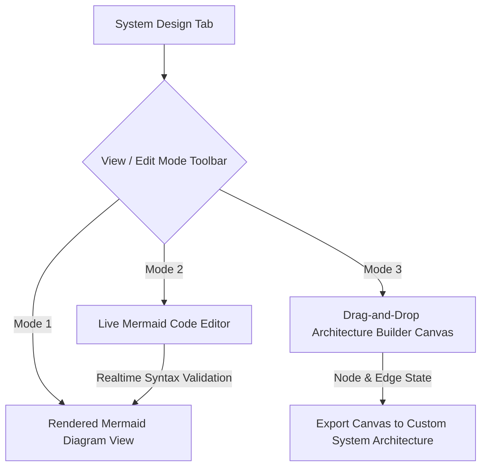

# Fix Spec 04: Interactive System Design Diagramming Canvas

- **Issue Type:** GAP
- **Target File(s):** [components/SystemDesignDiagram.tsx](file:///Users/dhananjayrawat/Antigravity/PrepAI/prepai/components/SystemDesignDiagram.tsx)
- **Priority:** HIGH
- **Affected Route(s):** Question Cards on `/` and `/dashboard/[id]`

---

## 1. Current State & Root Cause Analysis

In [SystemDesignDiagram.tsx](file:///Users/dhananjayrawat/Antigravity/PrepAI/prepai/components/SystemDesignDiagram.tsx), system design diagrams are rendered as static, read-only SVG graphics generated from fixed Mermaid text definitions.

### Limitations & Pain Points:
1. Candidates preparing for SDE 3 system design rounds at companies like Microsoft must practice **designing and editing** architecture diagrams on the fly during the interview.
2. Candidates cannot modify nodes, add database replicas, insert rate limiters, or test custom architecture variations.
3. If a Mermaid diagram contains syntax errors or fails to render, the component displays an unhelpful fallback error message without an interactive code recovery editor.

---

## 2. Proposed Technical Architecture



### Key Enhancements:
1. **Interactive Dual-Pane Mode:** Add a toggle between **"View Diagram"**, **"Edit Mermaid Code"**, and **"Interactive Whiteboard Canvas"**.
2. **Live Mermaid Code Editor:** Provide a live syntax-highlighted editor where candidates can modify Mermaid code (e.g. adding `Redis[(Redis Cluster)]` or `Kafka[[Event Stream]]`) with instant re-rendering.
3. **Architecture Component Palette:** Include quick drag/click component templates (API Gateway, Microservice, Redis Cache, Postgres DB, Kafka Broker, CDN, Load Balancer).
4. **Export Image / Copy Spec:** Allow candidates to export their custom architecture diagram as PNG or copy Mermaid syntax to their clipboard.

---

## 3. Step-by-Step Implementation Plan

### Step 3.1: Add Interactive State to `SystemDesignDiagram.tsx`

```tsx
export function SystemDesignDiagram({ chartCode, title }: SystemDesignDiagramProps) {
  const [code, setCode] = useState(chartCode);
  const [activeMode, setActiveMode] = useState<"preview" | "editor" | "canvas">("preview");
  const [renderError, setRenderError] = useState<string | null>(null);

  // Quick insertion helpers for system design components
  const addComponent = (snippet: string) => {
    setCode((prev) => `${prev.trim()}\n    ${snippet}`);
  };

  return (
    <div className="space-y-3 font-mono">
      {/* View Mode Toolbar */}
      <div className="flex items-center justify-between bg-paper p-2 rounded-lg border border-slate/10 text-xs">
        <div className="flex items-center space-x-2">
          <button
            onClick={() => setActiveMode("preview")}
            className={`px-3 py-1 rounded-md ${activeMode === "preview" ? "bg-focus text-white font-bold" : "text-slate"}`}
          >
            👁️ View Diagram
          </button>
          <button
            onClick={() => setActiveMode("editor")}
            className={`px-3 py-1 rounded-md ${activeMode === "editor" ? "bg-focus text-white font-bold" : "text-slate"}`}
          >
            ✏️ Edit Mermaid Code
          </button>
        </div>

        {activeMode === "editor" && (
          <div className="flex items-center space-x-1 text-[11px]">
            <button onClick={() => addComponent("Service --> Cache[(Redis Cache)]")} className="bg-paper-raised px-2 py-1 rounded border border-slate/20 hover:border-focus">
              + Add Cache
            </button>
            <button onClick={() => addComponent("Service --> Queue[[Kafka Queue]]")} className="bg-paper-raised px-2 py-1 rounded border border-slate/20 hover:border-focus">
              + Add Queue
            </button>
          </div>
        )}
      </div>

      {/* Editor Pane */}
      {activeMode === "editor" && (
        <textarea
          value={code}
          onChange={(e) => setCode(e.target.value)}
          className="w-full bg-neutral-950 text-emerald-400 p-4 font-mono text-xs rounded-xl border border-slate/20 h-48 focus:outline-none resize-y"
        />
      )}

      {/* Diagram Rendering View */}
      <div className="bg-paper p-4 rounded-xl border border-slate/10 overflow-x-auto">
        <MermaidRenderer chart={code} onError={(err) => setRenderError(err)} />
      </div>
    </div>
  );
}
```

---

## 4. Regression Prevention & Safety Mitigation

- **Mermaid Error Boundaries:** Wrap Mermaid rendering in a robust try-catch handler. If candidate types invalid Mermaid syntax in the live editor, render a clear inline notice (`"Syntax Error on line X - click Reset to restore default diagram"`) instead of crashing the UI.
- **SSR Hydration Safety:** Maintain the existing dynamic `import("mermaid")` inside `useEffect` to prevent server-side hydration mismatches.

---

## 5. Verification & Acceptance Criteria

1. **Live Edit Test:** Switch to *Edit Mermaid Code* mode, type `A --> B[Kafka Queue]`. Confirm diagram updates instantly with the new node.
2. **Error Recovery Test:** Type broken syntax `graph TD A --->`. Verify inline error notice is rendered without throwing unhandled React exceptions.
3. **Reset Test:** Click *Reset to Default*. Verify original diagram code is restored clean.
