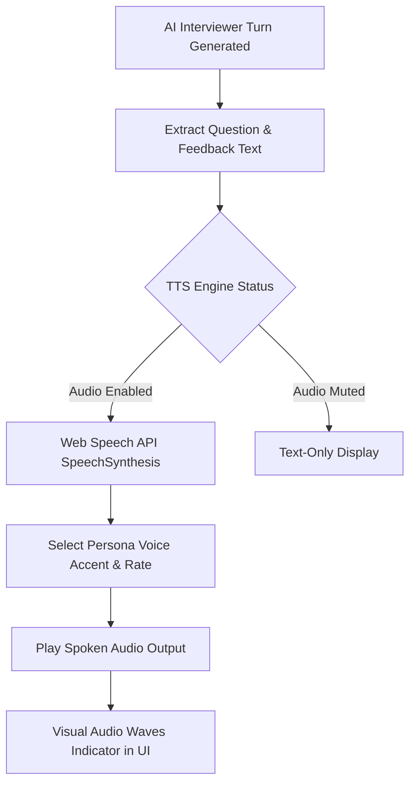

# Fix Spec 05: Spoken Voice Text-to-Speech (TTS) Mock Interviewer

- **Issue Type:** GAP
- **Target File(s):** [components/MockInterviewChat.tsx](file:///Users/dhananjayrawat/Antigravity/PrepAI/prepai/components/MockInterviewChat.tsx), `hooks/useTextToSpeech.ts` (New)
- **Priority:** HIGH
- **Affected Route(s):** `/dashboard/[id]/mock` and home mock mode

---

## 1. Current State & Root Cause Analysis

In [MockInterviewChat.tsx](file:///Users/dhananjayrawat/Antigravity/PrepAI/prepai/components/MockInterviewChat.tsx), candidates can speak their candidate responses using Web Speech API Speech-to-Text ([hooks/useSpeechToText.ts](file:///Users/dhananjayrawat/Antigravity/PrepAI/prepai/hooks/useSpeechToText.ts)). 

### Critical Gap & Impact:
- **One-Way Audio:** Voice works only for the *candidate's input*. When the AI interviewer ("Skeptical Principal Architect") evaluates the turn and generates a follow-up question, the response appears as text on screen.
- **Breaks Interview Realism:** Real interviews at top tech companies are live audio/video calls. Reading text paragraphs off a screen causes cognitive fatigue and fails to train candidate listening comprehension, verbal responsiveness, and pacing under pressure.

---

## 2. Proposed Technical Architecture



### Key Enhancements:
1. **`useTextToSpeech` Hook:** Create a reusable hook utilizing native browser `window.speechSynthesis`.
2. **Persona Voice Customization:** Match voice pitch and rate to the selected persona:
   - **Skeptical Architect:** Deep pitch, measured slow rate (0.9x).
   - **Time-Constrained Manager:** Brisk fast rate (1.15x).
   - **Friendly Peer:** Standard natural pitch and rate (1.0x).
3. **Audio Control Bar:** Add Mute/Unmute toggle button, speech playback status, and "Replay Audio" button.

---

## 3. Step-by-Step Implementation Plan

### Step 3.1: Create `hooks/useTextToSpeech.ts`

```typescript
import { useState, useEffect, useRef } from "react";

export function useTextToSpeech() {
  const [isSpeaking, setIsSpeaking] = useState(false);
  const [autoPlay, setAutoPlay] = useState(true);
  const synthRef = useRef<SpeechSynthesis | null>(null);

  useEffect(() => {
    if (typeof window !== "undefined" && "speechSynthesis" in window) {
      synthRef.current = window.speechSynthesis;
    }
  }, []);

  const speak = (text: string, rate: number = 1.0, pitch: number = 1.0) => {
    if (!synthRef.current) return;
    synthRef.current.cancel(); // Stop any active speech

    const utterance = new SpeechSynthesisUtterance(text);
    utterance.rate = rate;
    utterance.pitch = pitch;

    utterance.onstart = () => setIsSpeaking(true);
    utterance.onend = () => setIsSpeaking(false);
    utterance.onerror = () => setIsSpeaking(false);

    synthRef.current.speak(utterance);
  };

  const stop = () => {
    if (synthRef.current) {
      synthRef.current.cancel();
      setIsSpeaking(false);
    }
  };

  return { speak, stop, isSpeaking, autoPlay, setAutoPlay };
}
```

### Step 3.2: Integrate Audio into `MockInterviewChat.tsx`
- Call `speak()` automatically whenever a new interviewer question or follow-up is received.
- Render an animated soundwave indicator when `isSpeaking` is true.

```tsx
// Auto-speak new questions when received
useEffect(() => {
  if (autoPlay && question) {
    const rate = persona === "time_constrained_manager" ? 1.15 : 0.95;
    speak(question, rate);
  }
}, [question, persona]);
```

---

## 4. Regression Prevention & Safety Mitigation

- **Browser Autoplay Safety:** Browsers block audio autoplay until the user interacts with the page. Require candidate to click **"Start Mock Interview"** first, establishing user interaction gesture context for audio.
- **Graceful Feature Detection:** If `window.speechSynthesis` is unavailable (e.g. legacy browsers or strict privacy modes), fall back silently to text display without throwing errors.

---

## 5. Verification & Acceptance Criteria

1. **Auto-Speak Test:** Start mock interview. Verify AI interviewer speaks the opening question aloud.
2. **Mute Control Test:** Click Mute audio toggle button. Verify speech stops immediately.
3. **Persona Rate Test:** Switch between *Engineering Director* and *Skeptical Architect*. Confirm speech rate adjusts noticeably.
