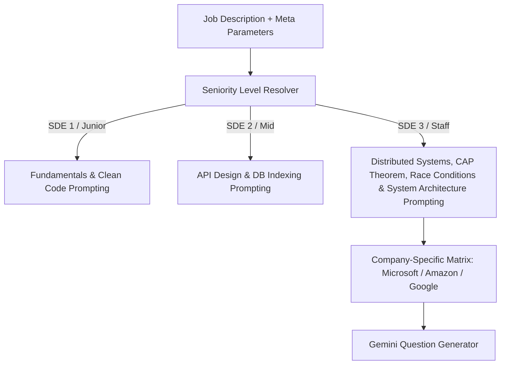

# Fix Spec 07: Seniority & Company-Tuned Question Depth Engine

- **Issue Type:** REVAMP
- **Target File(s):** [lib/gemini.ts](file:///Users/dhananjayrawat/Antigravity/PrepAI/prepai/lib/gemini.ts), [app/api/generate/route.ts](file:///Users/dhananjayrawat/Antigravity/PrepAI/prepai/app/api/generate/route.ts)
- **Priority:** HIGH
- **Affected Route(s):** `/` and `/dashboard/[id]`

---

## 1. Current State & Root Cause Analysis

In [lib/gemini.ts](file:///Users/dhananjayrawat/Antigravity/PrepAI/prepai/lib/gemini.ts), `generateQuestions()` relies on a general system prompt that instructs Gemini to *"Match difficulty to seniority inferred from the JD"*.

### Deficiencies & Pain Points:
1. **Shallow Question Calibration:** Senior (SDE 3) job descriptions frequently yield basic junior definition questions (e.g. *"What is SQL?"*, *"Difference between process and thread"*).
2. **Missing Tier-1 Company Structures:** Top product companies (Microsoft, Amazon, Google) have distinct interview loop patterns. For Microsoft SDE 3, interviewers focus heavily on **Low-Level Design (LLD / Object-Oriented Concurrency)**, **Distributed System Design (HLD / Failover)**, and **Leadership / Mentorship STAR scenarios**.

---

## 2. Proposed Technical Architecture



### Seniority Question Rules for SDE 3 / Staff:
- **Zero Basic Definitions:** Disallow questions asking "What is X?" or "Define Y".
- **Scenario-Driven Architectural Trade-offs:** Require real-world production failure scenarios (e.g., *"Design a distributed rate limiter in C# for 100k QPS across multi-region Azure clusters with sub-5ms SLA"*).
- **Mandatory Focus Areas:**
  - Concurrency & Synchronization (Mutexes, Lock-Free Data Structures, Async/Await memory overhead).
  - Data Storage at Scale (Sharding keys, Read/Write split, B-Tree vs GIN/LSM trees, Cache Stampede).
  - Distributed Systems (Partition tolerance, Consensus algorithms, Event replay in Kafka/Azure Service Bus).

---

## 3. Step-by-Step Implementation Plan

### Step 3.1: Add Seniority Prompt Profiles to `lib/gemini.ts`

```typescript
export function getSeniorityPromptInstructions(seniority: string, company: string): string {
  const level = seniority.toLowerCase();
  
  if (level.includes("sde 3") || level.includes("senior") || level.includes("staff")) {
    return `SENIORITY TIER: SDE 3 / STAFF (6-9+ Years Experience).
Strict Prompt Constraints for ${company}:
- DO NOT generate junior definition questions (e.g., "What is a REST API?").
- Questions MUST present high-scale, production-level engineering challenges with specific traffic numbers (e.g. 50,000 QPS, 99.99% availability SLA).
- System design questions MUST require trade-off analysis (CAP theorem, Cache invalidation strategies, DB Sharding, Concurrency bottlenecks).
- Behavioral questions MUST test cross-functional technical leadership, mentorship, resolving architectural disagreements, and post-mortem operational improvements.`;
  }

  return `SENIORITY TIER: MID LEVEL (3-5 Years Experience). Focus on clean code, API contracts, DB query optimization, and component design.`;
}
```

### Step 3.2: Update System Prompt in `generateQuestions()`
Inject `getSeniorityPromptInstructions()` into the primary Gemini `systemPrompt` string passed to `ai.models.generateContent()`.

---

## 4. Regression Prevention & Safety Mitigation

- **Fallback Handling:** If `seniority` or `company` is undefined, default to Mid/Senior tier guidelines ensuring high question quality without breaking legacy session generation calls.
- **JSON Parsing Safety:** Ensure the return schema structure remains 100% compliant with existing `QuestionData` interfaces to prevent UI breakage on question card rendering.

---

## 5. Verification & Acceptance Criteria

1. **SDE 3 Test Run:** Generate questions for Microsoft SDE 3 role. Verify 0 junior definition questions are returned.
2. **Scenario Complexity Test:** Confirm questions contain specific scale constraints (e.g. QPS throughput, SLA latency targets, failover conditions).
3. **Round Distribution Test:** Verify balanced representation across Round 1 (Screening), Round 2 (LLD/Coding), Round 3 (System Design), and Round 4 (Behavioral STAR).
