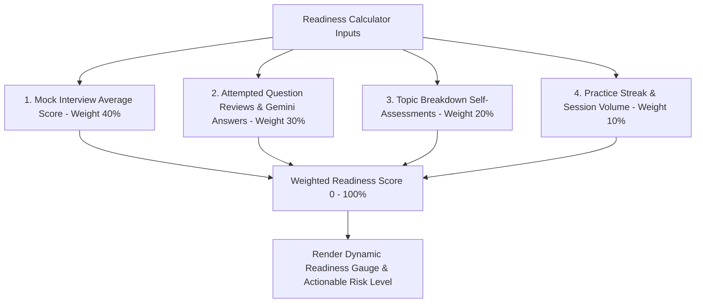

# Fix Spec 08: Performance-Weighted Readiness Score Algorithm

- **Issue Type:** BROKEN
- **Target File(s):** [lib/readiness.ts](file:///Users/dhananjayrawat/Antigravity/PrepAI/prepai/lib/readiness.ts), [components/ReadinessGauge.tsx](file:///Users/dhananjayrawat/Antigravity/PrepAI/prepai/components/ReadinessGauge.tsx)
- **Priority:** CRITICAL
- **Affected Route(s):** `/dashboard` and `/dashboard/[id]`

---

## 1. Current State & Root Cause Analysis

In [lib/readiness.ts](file:///Users/dhananjayrawat/Antigravity/PrepAI/prepai/lib/readiness.ts), the readiness score calculation logic is currently implemented as:

```typescript
// CURRENT FLAWED FORMULA IN lib/readiness.ts:
export function computeReadinessScore(categories: string[], bookmarks: any[]): number {
  const base = Math.min(categories.length * 15, 60);
  const bonus = Math.min(bookmarks.length * 5, 25);
  return Math.min(base + bonus + 15, 95);
}
```

### Critical Flaw & Impact:
- **Deceptive Metric:** The score increases simply by generating more sessions or adding bookmarks!
- **Zero Performance Accounting:** A candidate who scores 2/10 in every AI mock interview still receives an "85% High Interview Confidence" score. This gives candidates a false sense of security before a high-stakes interview.

---

## 2. Proposed Technical Architecture



### Formula Breakdown:
1. **Mock Interview Turn Performance (40% Weight):** Average score (out of 10) from candidate's AI mock interview turns.
2. **Interactive Answer Reviews (30% Weight):** Ratio of questions where the candidate opened, reviewed, or generated precise answers.
3. **Topic Self-Assessments (20% Weight):** Ratio of topics marked "Strong" vs "Weak" in [TopicBreakdownBar.tsx](file:///Users/dhananjayrawat/Antigravity/PrepAI/prepai/components/TopicBreakdownBar.tsx).
4. **Consistency & Streak (10% Weight):** Streak days bonus.

---

## 3. Step-by-Step Implementation Plan

### Step 3.1: Update `computeReadinessScore` in `lib/readiness.ts`

```typescript
export interface ReadinessInputs {
  mockScores?: number[];            // Scores from mock interview turns (e.g. [6, 8, 7])
  totalQuestions?: number;          // Total questions in active session
  reviewedQuestionsCount?: number;  // Questions where user viewed/generated precise answers
  strongTopicsCount?: number;       // Topics marked "strong"
  weakTopicsCount?: number;         // Topics marked "weak"
  streakDays?: number;              // Current practice streak
}

export function computePerformanceReadiness(inputs: ReadinessInputs): {
  score: number;
  label: string;
  colorClass: string;
} {
  const {
    mockScores = [],
    totalQuestions = 1,
    reviewedQuestionsCount = 0,
    strongTopicsCount = 0,
    weakTopicsCount = 0,
    streakDays = 0,
  } = inputs;

  // 1. Mock Score Component (40 pts max)
  let mockComponent = 20; // Default baseline if no mock turns taken yet
  if (mockScores.length > 0) {
    const avg = mockScores.reduce((a, b) => a + b, 0) / mockScores.length;
    mockComponent = (avg / 10) * 40;
  }

  // 2. Review Ratio Component (30 pts max)
  const reviewRatio = Math.min(reviewedQuestionsCount / Math.max(totalQuestions, 1), 1);
  const reviewComponent = reviewRatio * 30;

  // 3. Topic Self-Assessment Component (20 pts max)
  const totalTopics = strongTopicsCount + weakTopicsCount;
  let topicComponent = 10;
  if (totalTopics > 0) {
    topicComponent = (strongTopicsCount / totalTopics) * 20;
  }

  // 4. Streak Component (10 pts max)
  const streakComponent = Math.min(streakDays * 2, 10);

  const finalScore = Math.min(Math.round(mockComponent + reviewComponent + topicComponent + streakComponent), 100);

  let label = "Needs Practice";
  let colorClass = "text-coral border-coral/40 bg-coral/10";

  if (finalScore >= 80) {
    label = "Interview Ready";
    colorClass = "text-mint border-mint/40 bg-mint/10";
  } else if (finalScore >= 60) {
    label = "Moderate Confidence";
    colorClass = "text-highlight border-highlight/40 bg-highlight/10";
  }

  return { score: finalScore, label, colorClass };
}
```

### Step 3.2: Update Dashboard & Detail Page Gauges
Connect session mock scores and topic assessments to `computePerformanceReadiness()` in both [app/dashboard/page.tsx](file:///Users/dhananjayrawat/Antigravity/PrepAI/prepai/app/dashboard/page.tsx) and [app/dashboard/[id]/page.tsx](file:///Users/dhananjayrawat/Antigravity/PrepAI/prepai/app/dashboard/%5Bid%5D/page.tsx).

---

## 4. Regression Prevention & Safety Mitigation

- **Fallback Defaults:** If user has 0 mock turns and 0 topic assessments, default to a neutral baseline score (45% - Moderate Prep Needed) rather than 0% or fake 85%.
- **Type Safety:** Ensure optional chaining on all array parameters so legacy sessions missing `mockScores` evaluate cleanly without runtime errors.

---

## 5. Verification & Acceptance Criteria

1. **Low Performance Test:** Enter 3 mock interview turns with scores `[2, 3, 2]`. Verify readiness gauge drops to <40% ("Needs Practice").
2. **High Performance Test:** Enter mock scores `[9, 9, 10]`, mark topics "Strong". Verify gauge increases to >85% ("Interview Ready").
3. **Gauge Persistence Test:** Reload dashboard. Confirm gauge score matches computed performance.
