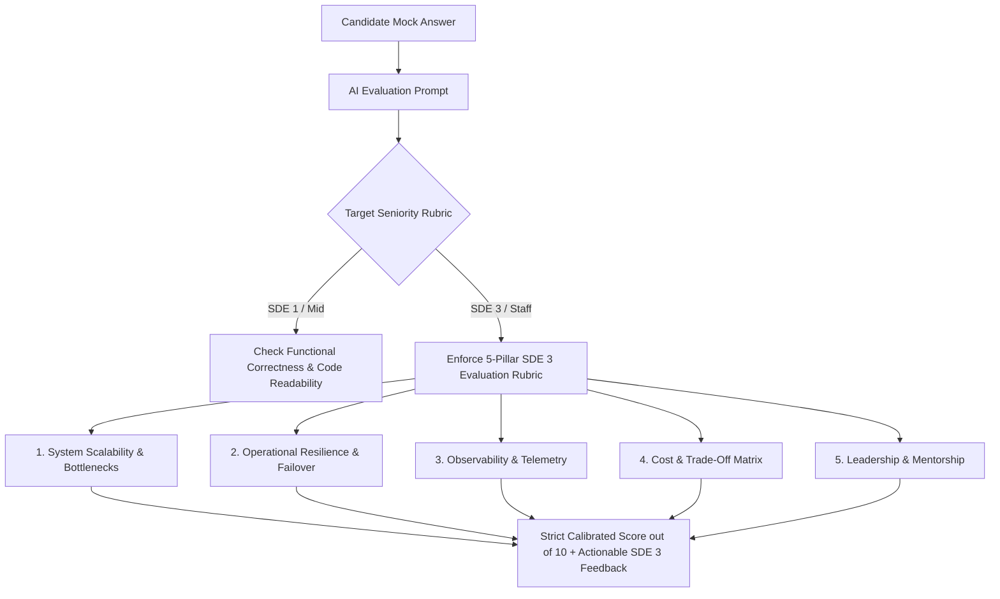

# Fix Spec 09: Role-Level SDE 3 Evaluation Rubrics

- **Issue Type:** GAP
- **Target File(s):** [lib/gemini.ts](file:///Users/dhananjayrawat/Antigravity/PrepAI/prepai/lib/gemini.ts), [app/api/mock-interview/route.ts](file:///Users/dhananjayrawat/Antigravity/PrepAI/prepai/app/api/mock-interview/route.ts)
- **Priority:** HIGH
- **Affected Route(s):** `/dashboard/[id]/mock` and question cards

---

## 1. Current State & Root Cause Analysis

In [lib/gemini.ts](file:///Users/dhananjayrawat/Antigravity/PrepAI/prepai/lib/gemini.ts), `mockInterviewTurn()` sends candidate answers to Gemini with general instructions to *"evaluate the candidate's answer score (1 to 10) and identify 2-3 key technical strengths and gaps"*.

### Deficiencies & Pain Points:
- **Uncalibrated Grading:** A simple mid-level explanation (e.g., *"I will use Redis to cache queries"*) receives 9/10 scores from the AI because the system prompt lacks explicit SDE 3 evaluation criteria.
- **Missing SDE 3 Expectations:** At senior levels (Microsoft SDE 3 / L63-L64), interviewers penalize candidates who fail to mention:
  - Operational Observability (Prometheus metrics, distributed tracing with OpenTelemetry).
  - High Availability & Failover (Multi-region replication, circuit breakers, graceful degradation).
  - SLA / SLO / Error Budgets (Sub-10ms p99 latency targets, 99.999% uptime).
  - Cost & Resource Efficiency (Memory consumption, connection pooling limits).

---

## 2. Proposed Technical Architecture



---

## 3. Step-by-Step Implementation Plan

### Step 3.1: Inject SDE 3 Rubric into `mockInterviewTurn()` in `lib/gemini.ts`

```typescript
export function getSDE3EvaluationRubric(roleSummary: string): string {
  return `EVALUATION RUBRIC FOR SENIOR ROLE (${roleSummary}):
You MUST grade strictly against Microsoft SDE 3 standards (6-9+ years experience).
Deduct score points if the candidate:
- Mentions a technology without explaining its failure modes (e.g. cache stampede, split-brain, memory saturation).
- Fails to quantify latency (p95/p99) or throughput (QPS).
- Omits operational observability (logging, metrics, tracing, alerts).
- Does not address disaster recovery or multi-region data consistency.

Score Calibration:
- 9 to 10: Exceptional senior answer covering architecture, trade-offs, SLAs, and failure modes.
- 6 to 8: Good functional answer, but missed key operational or scaling edge cases.
- 1 to 5: Junior/superficial answer missing core technical depth.`;
}
```

### Step 3.2: Update Prompt in `mockInterviewTurn()`

```typescript
const prompt = `${selectedPersona.prompt}

${getSDE3EvaluationRubric(roleSummary)}

Target Role Context: ${roleSummary}
Current Question: ${currentQuestion}
Candidate's Answer: ${candidateAnswer}
Recent Conversation History: ${JSON.stringify(history.slice(-4))}

Respond in JSON:
{
  "score": 7,
  "persona_title": "${selectedPersona.title}",
  "strengths": ["Clear explanation of Redis caching"],
  "gaps": ["Did not address cache stampede or LRU eviction policy under high memory pressure"],
  "strong_answer": "Model SDE 3 answer...",
  "next_question": "Follow up question..."
}`;
```

---

## 4. Regression Prevention & Safety Mitigation

- **Fallback Grace:** If the candidate is interviewing for an entry-level position (SDE 1), bypass the SDE 3 rubric to avoid unfairly low scores.
- **JSON Structure Stability:** Ensure the returned payload structure (`score`, `strengths`, `gaps`, `strong_answer`, `next_question`) remains unchanged so front-end components render smoothly.

---

## 5. Verification & Acceptance Criteria

1. **Basic Answer Test:** Submit a basic 1-sentence answer to an SDE 3 system design question. Confirm AI score is penalized (<5/10) with feedback highlighting missing SLA/observability edge cases.
2. **Comprehensive Answer Test:** Submit a detailed answer covering multi-region sharding, cache eviction, and telemetry. Confirm score is 9-10/10 with positive strength points.
