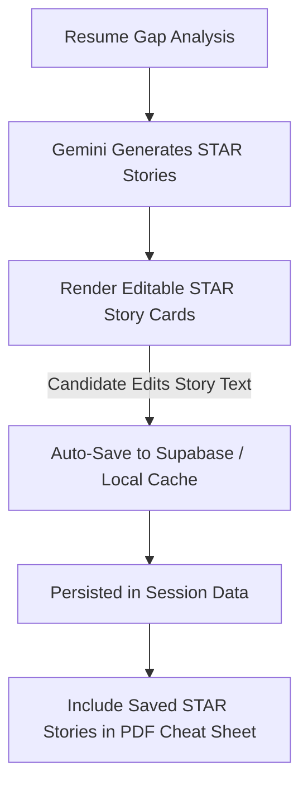

# Fix Spec 10: Persistent & Editable STAR Stories Engine

- **Issue Type:** FRICTION
- **Target File(s):** [components/ResumeGapVisualizer.tsx](file:///Users/dhananjayrawat/Antigravity/PrepAI/prepai/components/ResumeGapVisualizer.tsx), `app/api/user/star-stories/route.ts` (New)
- **Priority:** MEDIUM
- **Affected Route(s):** `/dashboard/[id]`

---

## 1. Current State & Root Cause Analysis

In [ResumeGapVisualizer.tsx](file:///Users/dhananjayrawat/Antigravity/PrepAI/prepai/components/ResumeGapVisualizer.tsx), Gemini generates tailored STAR stories (Situation, Task, Action, Result) to help candidates bridge resume gaps.

### Limitations & Pain Points:
1. **Transient State:** Generated STAR stories exist only in local React component state (`const [result, setResult] = useState(...)`).
2. **Loss on Navigation:** As soon as the candidate switches tabs or refreshes the page, all generated STAR stories disappear.
3. **No Edit Control:** Candidates cannot edit the suggested stories to add personal details from their actual past projects.

---

## 2. Proposed Technical Architecture



### Key Enhancements:
1. **Inline Text Editing:** Make STAR story cards editable (inline `<textarea>` or contenteditable inputs for Situation, Action, Result).
2. **Supabase Persistence:** Store saved STAR stories in a `star_stories` JSON column inside the `sessions` table.
3. **Add Custom Story:** Allow candidates to click **"+ Add Personal STAR Story"** to record custom stories for behavioral rounds.

---

## 3. Step-by-Step Implementation Plan

### Step 3.1: Database Schema Addition
```sql
ALTER TABLE sessions ADD COLUMN IF NOT EXISTS star_stories JSONB DEFAULT '[]'::jsonb;
```

### Step 3.2: Update `ResumeGapVisualizer.tsx` with Persistence Controls

```typescript
export interface StarStory {
  id: string;
  competency: string;
  situation: string;
  suggestedStory: string;
  userEditedStory?: string;
}

// Save edited STAR stories to Supabase endpoint
async function saveStarStories(sessionId: string, stories: StarStory[]) {
  await fetch("/api/user/star-stories", {
    method: "POST",
    headers: { "Content-Type": "application/json" },
    body: JSON.stringify({ sessionId, stories }),
  });
}
```

---

## 4. Regression Prevention & Safety Mitigation

- **Local Cache Fallback:** Save edits to `localStorage` simultaneously so that offline or unauthenticated users retain their edited stories across refreshes.
- **Graceful Null Check:** If a session has no stored `star_stories`, initialize with empty array without throwing render errors.

---

## 5. Verification & Acceptance Criteria

1. **Edit Test:** Generate STAR stories, edit the *Suggested Story* text. Refresh page. Confirm edited text persists.
2. **Custom Story Test:** Click *+ Add Personal STAR Story*, enter details, save. Confirm new story is saved to session.
