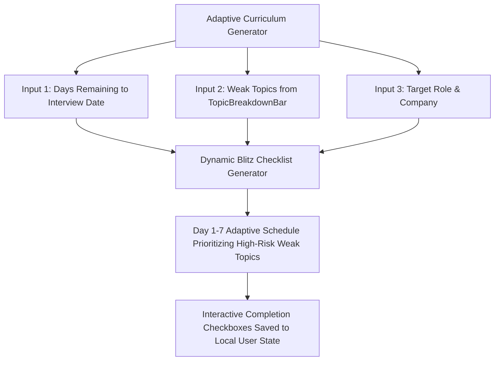

# Fix Spec 13: Dynamic Adaptive 7-Day Blitz Curriculum

- **Issue Type:** REVAMP
- **Target File(s):** [components/CountdownCurriculumWidget.tsx](file:///Users/dhananjayrawat/Antigravity/PrepAI/prepai/components/CountdownCurriculumWidget.tsx)
- **Priority:** MEDIUM
- **Affected Route(s):** `/dashboard`

---

## 1. Current State & Root Cause Analysis

In [CountdownCurriculumWidget.tsx](file:///Users/dhananjayrawat/Antigravity/PrepAI/prepai/components/CountdownCurriculumWidget.tsx), PrepAI displays a fixed 7-day study curriculum checklist:

```typescript
// CURRENT HARDCODED STATIC CHECKLIST:
const DEFAULT_DAYS = [
  { day: 1, title: "System Design Foundations", focus: "Load Balancing & Caching" },
  { day: 2, title: "Database & Storage", focus: "SQL vs NoSQL, Indexing" },
  // ...
];
```

### Deficiencies & Pain Points:
1. **Static Content:** The checklist is identical for every candidate regardless of their target role (e.g. SDE 3 vs Frontend Engineer) or target company (Microsoft vs Startup).
2. **Ignores Self-Assessed Weaknesses:** If a candidate marks *"PostgreSQL Indexing"* as **Strong** and *"Kafka Event Streaming"* as **Weak** in [TopicBreakdownBar.tsx](file:///Users/dhananjayrawat/Antigravity/PrepAI/prepai/components/TopicBreakdownBar.tsx), the static widget still forces them through static Day 1/2 tasks instead of prioritizing their actual weak topics.

---

## 2. Proposed Technical Architecture



---

## 3. Step-by-Step Implementation Plan

### Step 3.1: Implement Adaptive Schedule Generator

```typescript
export function generateAdaptiveCurriculum(
  weakTopics: string[],
  targetCompany: string = "Target Role",
  daysRemaining: number = 7
): Array<{ day: number; title: string; focus: string; topicId?: string }> {
  // If user has specific weak topics, insert them into Days 1-3
  const schedule = [];
  
  for (let i = 1; i <= Math.min(daysRemaining, 7); i++) {
    if (weakTopics[i - 1]) {
      schedule.push({
        day: i,
        title: `Priority Weak Area: ${weakTopics[i - 1]}`,
        focus: `Deep-dive documentation, precise model answers & architectural trade-offs for ${weakTopics[i - 1]}.`,
      });
    } else {
      // Default fallback days for remaining schedule
      const defaultTopics = [
        { title: "High-Level System Design & Scalability", focus: "Multi-region replication, partitioning & rate limiting." },
        { title: "Low-Level Design & Concurrency", focus: "Thread safety, lock-free queues, OOP design patterns." },
        { title: "Behavioral & Leadership STAR Stories", focus: "Cross-functional conflict, project ownership, mentorship." },
        { title: "Full Mock Interview Simulation", focus: "Timed voice mock interview turns & performance review." },
      ];
      const fallback = defaultTopics[(i - 1) % defaultTopics.length];
      schedule.push({ day: i, title: fallback.title, focus: fallback.focus });
    }
  }

  return schedule;
}
```

---

## 4. Regression Prevention & Safety Mitigation

- **Persistence:** Store checkbox completion state in `localStorage` (`prepai_blitz_checklist_state`) so checked items remain saved across browser reloads.
- **Graceful Bounds:** Handle edge cases where `daysRemaining` is 1 or >30 smoothly without broken layout renders.

---

## 5. Verification & Acceptance Criteria

1. **Adaptive Test:** Mark topic *"Kafka Streaming"* as **Weak** in session topic bar. Open Dashboard. Verify Day 1 curriculum title updates to *"Priority Weak Area: Kafka Streaming"*.
2. **Checkbox State Test:** Check Day 1 task complete. Reload page. Verify Day 1 remains checked.
